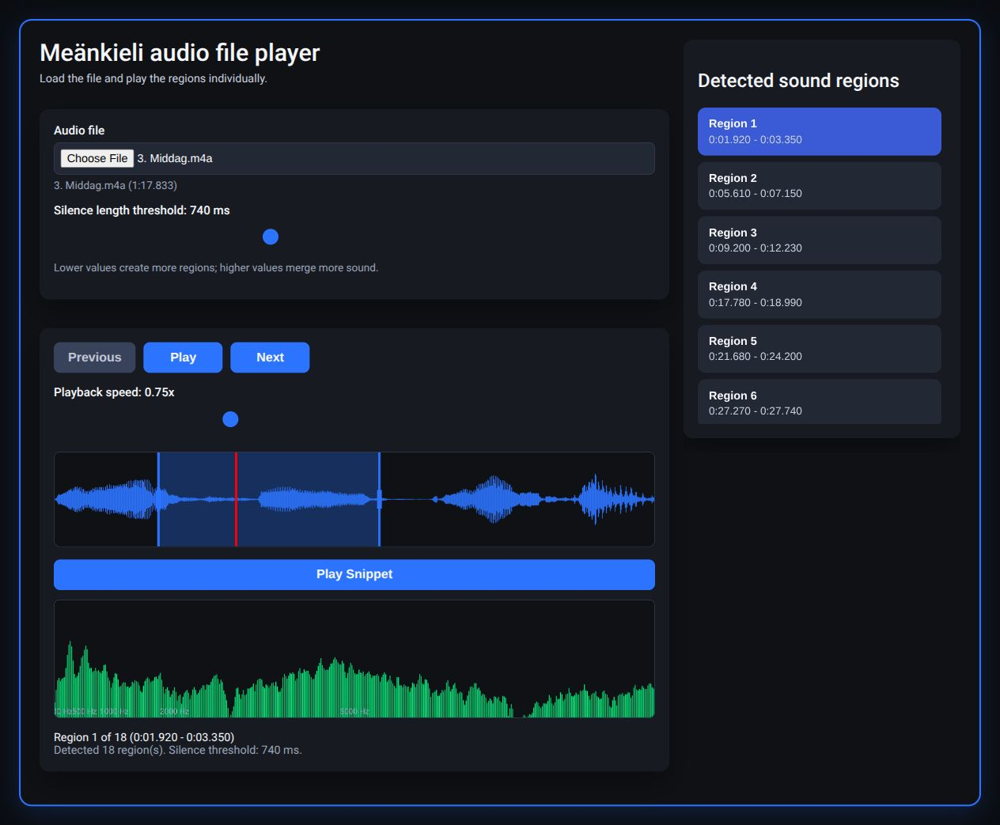
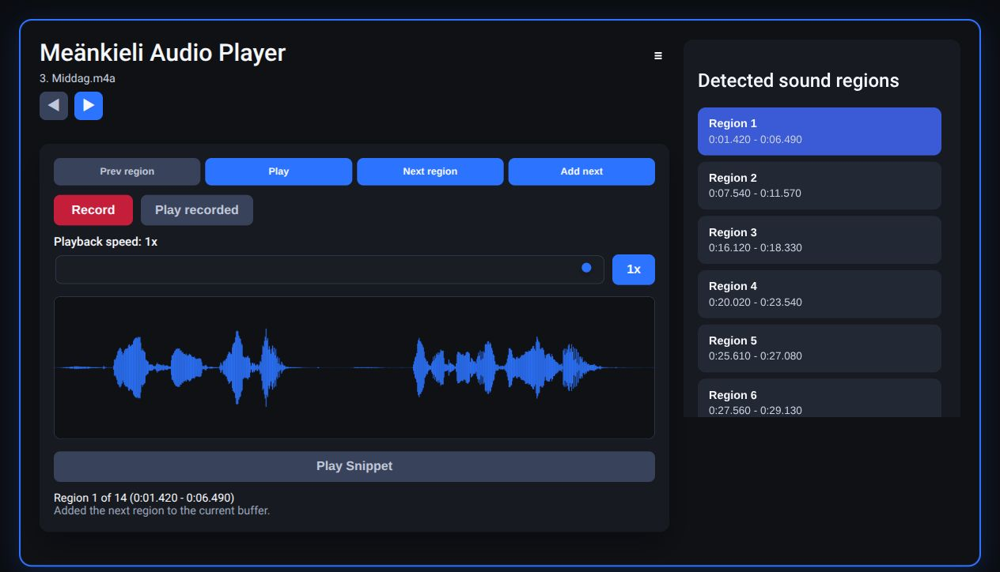
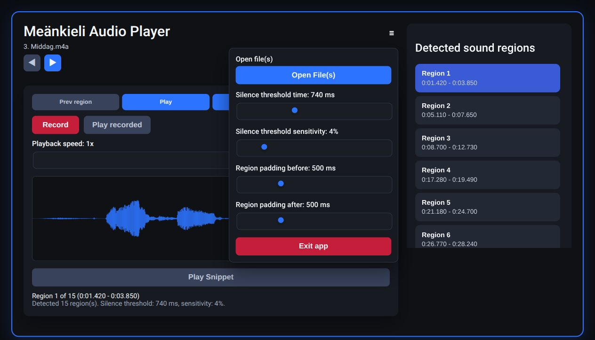

# Apps and how to use them

[Repository guide](../../README.md) · [Study recordings and text](../Audio%20files%20for%20android%20app/README.md)

## Web audio player

[Download the HTML file](Audio_player_web_version.html), then open the downloaded file in a current browser. GitHub's file view displays source rather than running the app. No build step is needed. The supplied HTML has no external script dependencies or remote upload endpoint; it reads selected audio locally using the browser audio APIs.

1. Choose **Audio file** and select a downloaded recording.
2. Wait for decoding and the **Detected sound regions** list. Select a region, or use **Previous** and **Next**.
3. Press **Play** to listen to the selected region. Adjust **Playback speed** from 0.25× to 2× for practice.
4. Adjust **Silence length threshold** (50–2,000 ms) if the divisions are unsuitable. Shorter silence thresholds tend to split more phrases; longer thresholds tend to group them.
5. Drag across the waveform to select part of the current region, adjust the selection edges, and press **Play Snippet**. The lower panel displays a spectrum.

The file selector and silence threshold are on the left, playback and waveform below, and selectable regions on the right. In this actual browser run, `3. Middag.m4a` decoded to 1:17.833 and produced 18 regions with the default 740 ms silence threshold.

The blue area marks the selected snippet; the red line is the playback position. The screenshot shows the supplied player running at 0.75×, with its waveform and spectrum populated by the original recording. Navigation, speed changes, region playback, selection, and snippet playback were exercised in desktop Chromium. Other browsers and mobile platforms have not been tested here.

## Android dialogue trainer v0.3

[Download dialogue-trainer-v0.3.apk](dialogue-trainer-v0.3.apk) (5.56 MiB). Its original bundled HTML interface was run in desktop Chromium to inspect the controls below. A local browser harness passed the supplied recordings through the interface's existing Android callbacks. These are screenshots of the running bundled interface; they are **not Android device or emulator screenshots**. Installation, Android file permissions, microphone recording, and native lifecycle behavior remain untested. On an Android device, use your normal approved APK installation process, then launch the app. No Android installation was performed during this import.

The intended APK workflow, based on the bundled interface and bridge calls, is to open the app, open **☰ → Open File(s)**, choose recordings, and practice selected regions. File arrows move between selected recordings; **Prev region**, **Play/Stop playing**, and **Next region** control the current phrase. **Add next** joins the next region into the current practice buffer. **Playback speed** runs from 0.1× to 1×, and **1x** restores normal speed. Drag the waveform to select a snippet.

This screen includes region navigation, **Add next**, **Record**, **Play recorded**, speed/reset controls, the waveform, snippet playback, and the region list. The original dinner recording initially produced 15 regions at default settings. After **Add next**, the running interface reported 14 regions and “Added the next region to the current buffer.” Native recording buttons are present, but microphone recording was not exercised.

The menu exposes file selection, silence time (50–2,000 ms), sensitivity (1–25%), and padding before/after regions (0–2,000 ms), plus **Exit app**. The screenshot shows the defaults: 740 ms, 4%, and 500 ms padding on either side. Open the menu to tune phrase boundaries; test short samples before larger files. The browser harness verified these controls' visibility, sample decoding, region navigation, **Add next**, and speed reset. It did not reproduce the full Android environment.

## Android dictionaries

`Meankieli_dict_large.apk` (22.18 MiB) and `meankieli_dict_small.apk` (13.02 MiB) are native Android dictionary packages. Both bundle a Meänkieli–Swedish XML dictionary; the smaller package also includes SQLite/SQL assets. Its packaged strings include “Sök svenska eller meänkieli...”, indicating a bilingual search field. UI screens, installation steps specific to Android versions, and device behavior have not been verified, and no screenshots have been fabricated.

These APKs are retained locally while their dictionary data source and redistribution terms are checked. There are no download links in this checkpoint. The remaining native app screenshots require a suitable approved Android environment or screenshots supplied by the owner.

## Keyboard wordlist archive

The original `dictionary for chrome.zip` contains only `dictionary.txt`, not a Chrome extension. Its header identifies the **Gboard Dictionary version 1** format, with shortcut/word/language-tag columns and 14,575 data rows. It should be treated as a keyboard dictionary import file, despite its original filename. A Gboard import was not attempted, and no Chrome installation workflow is claimed. The archive remains local while vocabulary provenance is checked.
