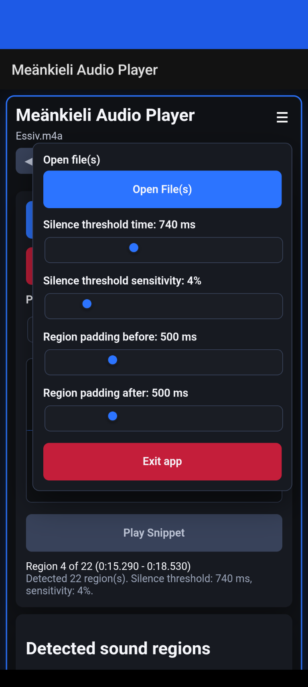
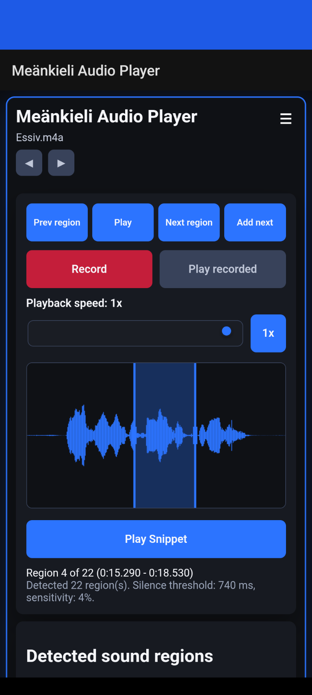
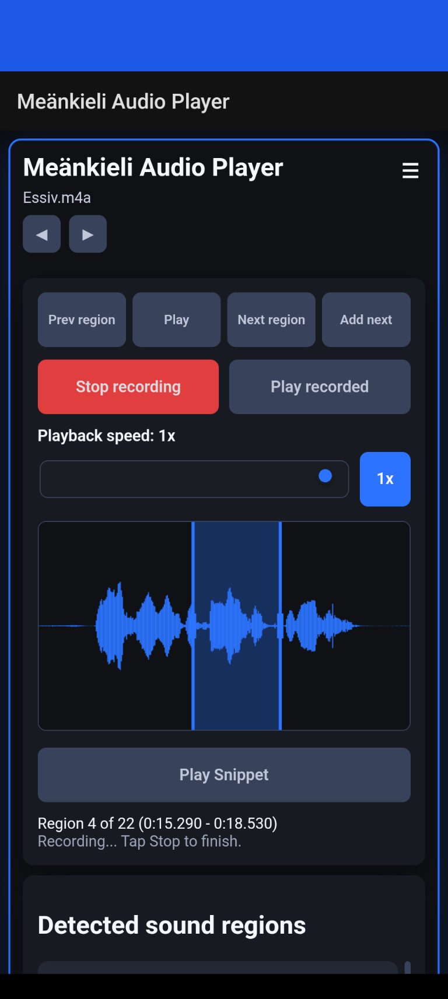

# Apps and how to use them

[Repository guide](../../README.md) · [Study recordings and text](../Audio%20files%20for%20android%20app/README.md)

[Dictionary](#android-dictionaries) · [Android audio trainer](#android-dialogue-trainer-v03) · [Web player](#web-audio-player) · [Keyboard wordlist](#keyboard-wordlist-archive)

## Android dictionaries

[Download the large dictionary APK](https://raw.githubusercontent.com/soomrenald/meankieli-laromedel/main/Me%C3%A4nkieli/Apps/Meankieli_dict_large.apk) (22.18 MiB) · [Download the small dictionary APK](https://raw.githubusercontent.com/soomrenald/meankieli-laromedel/main/Me%C3%A4nkieli/Apps/meankieli_dict_small.apk) (13.02 MiB).

Use Android’s APK installation flow, then launch the dictionary. Both packages require Android 7.0 or later and use the same package ID: choose one variant. Installation and switching compatibility have not been tested here. Both contain the same Meänkieli–Swedish XML dictionary; [data attribution and component notices](../../docs/DATA_SOURCES.md) identify its official CC0 source. The original APKs are unchanged.

*Example dictionary search and results.*

1. Tap the search field and type a Swedish or Meänkieli word. In the Swedish-labelled interface, pause briefly for the results to update.
2. Read **Exakt Matchning** first for exact matches, then **Delmatch** for partial matches. The counts show how many results belong to each group. Scroll to read more cards.
3. Each card gives the Meänkieli headword, its word class, and Swedish translation. **Examples** show Meänkieli sentences with Swedish counterparts when the entry contains them. Details are inline; the supplied screen has no separate detail or Copy button.
4. Tap **×** to clear the search and enter another word.

The packaged versions have different databases:

| Package | database |
| --- | --- |
| Small APK | https://språk.isof.se/meänkieli |
| Large APK | https://språk.isof.se/meänkieli and https://meankielensanakirja.com/. This version is not optimized and loads very slow. Not recommended for use. |

## Android dialogue trainer v0.3

[Download dialogue-trainer-v0.3.apk](dialogue-trainer-v0.3.apk) (5.56 MiB). The manifest requires Android 8.0 or later. Install the APK and launch **Meänkieli Audio Player**. The native code requests microphone and audio/media access; Microphone access is needed to record your speech.

### Playback and navigation

*Playback of **Essiv.m4a**, region 4 of 22. The red vertical line marks the current playback position within the displayed region.*

| Control or display | How to use it |
| --- | --- |
| Filename and **◀ / ▶** below it | Show the current audio file and move between files selected together. File arrows are disabled at the ends or when only one file was selected. |
| **Detected sound regions** | Scroll below the waveform and tap a region to select it and start playback. The current region is highlighted. |
| **Prev region / Next region** | Move one region backward or forward and start playing it. They stop at the first and last region. |
| **Play / Stop playing** | Play the current region, or stop it early. A new **Play** starts again at the region’s beginning; this is a stop/restart control, not pause/resume. Playback ends at the region boundary. |
| Red waveform line | Follows the original audio or snippet while it plays. Dragging the waveform selects a snippet rather than seeking with this line. |
| **Playback speed** | Drag from 0.1× to 1× to slow the source region or snippet. Tap **1x** to restore normal speed. |
| Region/status text | Shows the current region number, start/end times, total regions, detection settings, or the current action/error. |
|**Add next**|A long silence inside one utterance can make the detector split it into separate regions. **Add next** lets you repair that split while studying. Details are explained below.|

To repeat an utterance, tap **Play** again after it finishes.

### Load files and tune the region boundaries

*The **☰** menu loads recordings and adjusts detection. This capture shows the packaged defaults: 740 ms silence time, 4% sensitivity, and 500 ms padding on each side.*

1. Download a [study recording](../Audio%20files%20for%20android%20app/README.md).
2. Tap **☰ → Open File(s)** and choose one or more audio files in Android’s file picker. The filename appears after loading; wait for region detection to finish.
3. Tap **☰** again or outside the menu to close it. Choose a region and listen before changing its boundaries.

## Fine tuning audio file section parsing
It may be necessary in some cases to adjust how the app is separating speech into distinct utterances. For the most part this is handled correctly with the default settings, but these controls can be used to adjust parameters as needed.

| Menu setting | Effect and practical use |
| --- | --- |
| **Silence threshold time** — 50–2,000 ms | How long a quiet gap must be before it can separate regions. Increase it when one utterance is split too often; decrease it when several utterances are grouped together. Default: 740 ms. |
| **Silence threshold sensitivity** — 1–25% | Higher values classify more quiet sound as silence and may omit quiet speech. Lower values retain quieter speech but may include more background noise. Default: 4%. |
| **Region padding before** — 0–2,000 ms | Adds audio before each detected region to keep its opening sounds. If the beginning of an utterance is clipped, increase this value. Default: 500 ms. |
| **Region padding after** — 0–2,000 ms | Adds audio after each region to keep its ending sounds. Often the ending sounds are detected as silence, and will be clipped. Increase this value if final words are cut off. Default: 500 ms. Overlapping padded regions are merged automatically. |
| **Exit app** | Stops playback, clears loaded audio and the in-app take, releases native recording resources, and closes/removes the app task. |

Releasing a detection or padding slider reanalyzes the current working audio, rebuilds the region list, clears the snippet selection, and returns to region 1. Tune these settings before making manual repairs. Android’s **Back** follows WebView history when available, otherwise normal Android Back behavior; **Exit app** explicitly performs the cleanup above.

### Repair an utterance with Add next

If most of the utterances are correctly combined/separated, or you don't want to reload the entire file and seek to the location you were at, this function allows you to combine successive utterances that should be in a single section but are split due to silence regions detected within the utterance.

1. Tap the first affected region in **Detected sound regions**, or reach it with **Prev region / Next region**. Listen to locate the split, then tap **Stop playing** if it is still playing.
2. Tap **Add next**. The following region is merged into the current one. The current region stays selected, one entry disappears from the list, and the waveform redraws with any snippet selection cleared.
3. Tap **Play** to hear the joined utterance. If it was split into three or more regions, tap **Add next** again for each additional part, checking the result as you go. It is disabled on the last region.

When there is an unpadded gap between the two regions, the code shortens that gap to at most 100 ms in the working audio. Later region times shift accordingly. The source file is not overwritten, and there is no Undo or export control. Reopen the original recording to undo an unwanted repair; changing files and loading the original again also restores it. Reanalysis rebuilds the boundaries from the current working audio, so it does **not** restore silence already trimmed by **Add next**.

### Select and play a snippet

*The blue interval and its two vertical edges select a shorter part of the current region. **Play Snippet** is ready to play that interval.*

1. Stop source playback, then drag across the waveform to select a word or phrase. The blue shaded area is the selection.
2. Drag either blue edge to refine the start or end.
3. Tap **Play Snippet**. It uses the selected playback speed and stops at the selection’s end. Tap **Stop playing** to stop early, or **Play Snippet** again afterward to repeat.
4. To return to the whole region, tap **Play**. To replace the selection, drag elsewhere on the waveform. Changing regions, reanalysis, or **Add next** clears the snippet selection; there is no separate snippet-exit button.

### Record and compare your speech

*Speech recording is active. **Record** has become **Stop recording**, and the main region/snippet controls are disabled.*

1. Listen to the original region or snippet, then stop playback.
2. Tap **Record** and speak your version. Grant microphone access if Android requests it.
3. Tap **Stop recording**. Wait for the take to decode and **Play recorded** to become available. **Recording saved** means it is ready for in-app replay.
4. Tap **Play recorded** to listen at normal speed. The same button becomes **Stop playing** while your take plays; tap it to stop early. Return to **Play** or **Play Snippet** to compare with the original.
5. Record another completed take to replace the one available for replay. **Exit app** clears it. This version has no separate recording Reset, Save, Share, or Export button; the native temporary recording file is deleted after it is handed to the player.

## Web audio player

[Download the HTML file](Audio_player_web_version.html) and open it locally in a current browser. GitHub’s file view displays source rather than running the app. It needs no build step and reads the selected recording locally; the supplied HTML has no external script dependencies or remote upload endpoint. This is a deprecated version equivalent to v0.1. It is standalone and will work on any browser, but lacks many of the newer features. It is retained for archival purposes and PC-based practice. No further development is planned for this implementation.

| Control or display | How to use it |
| --- | --- |
| **Audio file** | Choose one downloaded recording. The file metadata and detected regions appear after decoding. Selecting another file replaces the current audio. |
| **Detected sound regions / Previous / Next** | Tap a list entry or a navigation button to select and immediately play a region. The region number and time bounds show what is selected. |
| **Play** | Starts the selected region from its beginning; tap again to restart. It ends at the region boundary. There is no pause/resume or automatic loop control. |
| **Playback speed** — 0.25×–2× | Slow down or speed up source/snippet playback. Move it back to 1× for normal speed; the web version has no separate **1x** reset button. |
| **Silence length threshold** — 50–2,000 ms | Increase it to group more sound or decrease it to split more regions. Releasing it reanalyzes the file and clears the snippet selection. Default: 740 ms. |
| Waveform and **Play Snippet** | Drag to select an interval, refine its edges, and play it. Use **Play** for the whole region or change regions to clear the selection. |
| Lower spectrum panel | Shows frequency content during playback or around the waveform cursor/selection edge while inspecting the audio. |

The web version does not expose the Android trainer’s multi-file arrows, adjustable sensitivity/padding, **Add next**, microphone recording, or **Exit app** menu. Close its browser tab when finished. The web player was exercised in desktop Chromium with an original recording; other browsers and mobile platforms remain untested here. [Verification notes](../../docs/IMPORT.md) retain those preliminary checks. All screenshots in this guide are the owner’s actual Android captures.

## Keyboard wordlist archive

[Download the original dictionary for chrome.zip](../dictionary%20for%20chrome.zip) (52.20 KiB). It contains `Gboarddictionary.txt`, a 14,575-row Gboard-style wordlist. Extract it and use Gboard’s personal-dictionary import if your Gboard version supports that format. The words match the official CC0 dictionary headwords; [source evidence](../../docs/DATA_SOURCES.md) records the check. Keyboard import and version-specific steps have not been tested here.

## Earlier versions

[Earlier trainer APKs](../Archive/README.md) are preserved for reference. The screenshots and control instructions above describe the current trainer interface; they do not verify archived versions.
