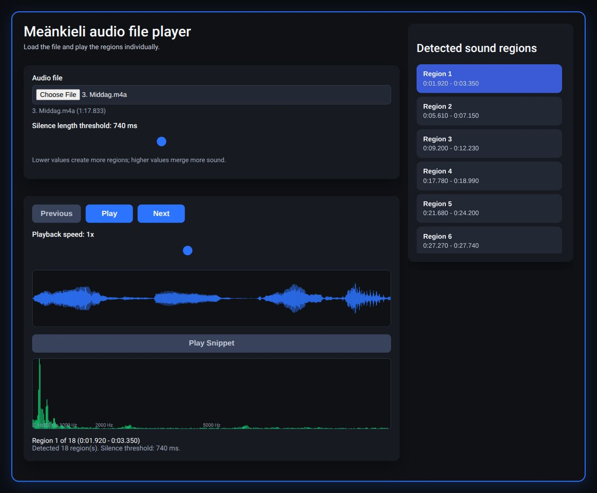

# Meänkieli self-study materials

Läromedel i meänkieli för självstudier.

This collection brings together dialogue recordings, grammar examples, source documents, and local study apps. Start by reading a folder's dialogue text, then practice its recording in the browser audio player.

**Progress checkpoint:** the recordings, Word documents, folder READMEs, browser player, and four real interface screenshots are prepared for inspection. Android dictionary screenshots and dictionary/vocabulary redistribution review remain incomplete. The trainer screenshots show its actual bundled interface running in a browser harness; native Android features are untested.

## Start studying

1. [Choose a dialogue or grammar folder](Me%C3%A4nkieli/Audio%20files%20for%20android%20app/README.md). Each folder displays its source text and links to the original document.
2. Download a recording, then [download the web audio player](Me%C3%A4nkieli/Apps/Audio_player_web_version.html) and open the HTML file locally.
3. Follow the [screen-by-screen app guide](Me%C3%A4nkieli/Apps/README.md): load audio, choose a detected region, slow it down, and replay a waveform snippet.



The left side selects audio and controls playback; the right side lists detected phrases. The [app guide](Me%C3%A4nkieli/Apps/README.md) explains all four screenshots and which features were tested.

## Repository structure

```text
README.md
docs/
  MEDIA.md
  IMPORT.md
  archive-manifest.json
  screenshots/
Meänkieli/
  Apps/
    Audio_player_web_version.html
    dialogue-trainer-v0.3.apk
    README.md
  Audio files for android app/
    set 1/                  20 everyday-dialogue recordings
    set 2/                  15 numbered conversations
    set 3/                  10 page-named recordings and replacement source
    grammatik/
      böjning/              12 case recordings
      prepositioner/        11 preposition recordings
      dåtid/                15 past-tense recordings, including an alternate take
  Completed audio files/
    Del 1/                  20 MP3/WAV recordings
    Del 2/                  15 processed WAV recordings
    Del 3/                   5 processed case WAV recordings
  Docs/                     Word originals and readable Markdown
  Archive/                  earlier trainer APKs and replaced Set 3 document
```

[Browse all materials](Me%C3%A4nkieli/README.md) · [Documents](Me%C3%A4nkieli/Docs/README.md) · [Original recordings](Me%C3%A4nkieli/Completed%20audio%20files/README.md)

## Dialogue sources

The folder READMEs contain the original dialogue and grammar text rather than Drive shortcut placeholders. Meänkieli, Swedish, English headings, spelling, diacritics, variants, and notes are retained. This is a presentation and organization pass, not a language correction pass.

Set 1, Set 2, and Böjning use matching sections of the course material. Prepositioner uses its included document, and Dåtid uses the seven verb-type perfect/imperfect tables. Set 3 uses the replacement supplied by the owner; the earlier three-dialogue file is archived. Page-to-paragraph boundaries and every audio line have not been independently verified. See [import and verification notes](docs/IMPORT.md).

## App coverage and remaining work

The browser player ran with an original recording. The dialogue trainer's original v0.3 HTML ran with the same recording through a browser harness. Native Android installation, microphone recording, and the two native dictionary interfaces need further verification and actual Android screenshots. Dictionary APKs, keyboard vocabulary, and the two vocabulary spreadsheets remain preserved locally and are described without unavailable download links.

The original 436.6 MiB Drive ZIP stays outside Git. Large recording originals are preserved without transcoding; see [media storage notes](docs/MEDIA.md). No Git LFS or account billing settings were enabled.
