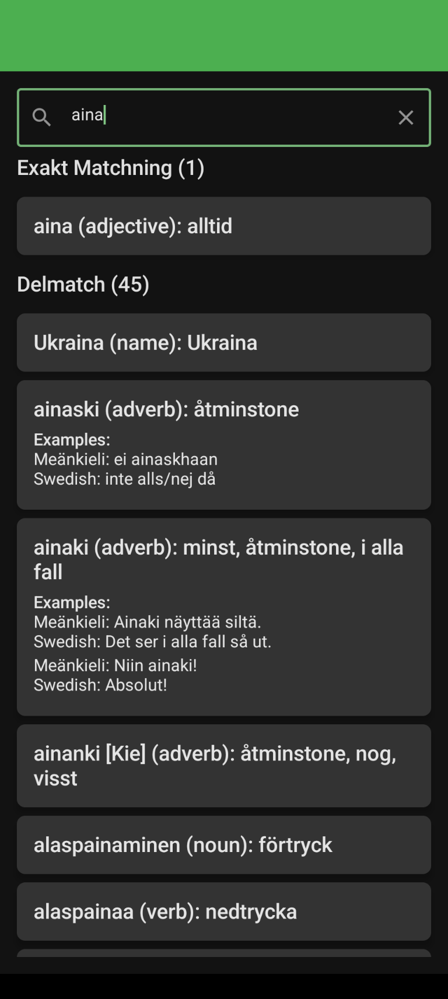
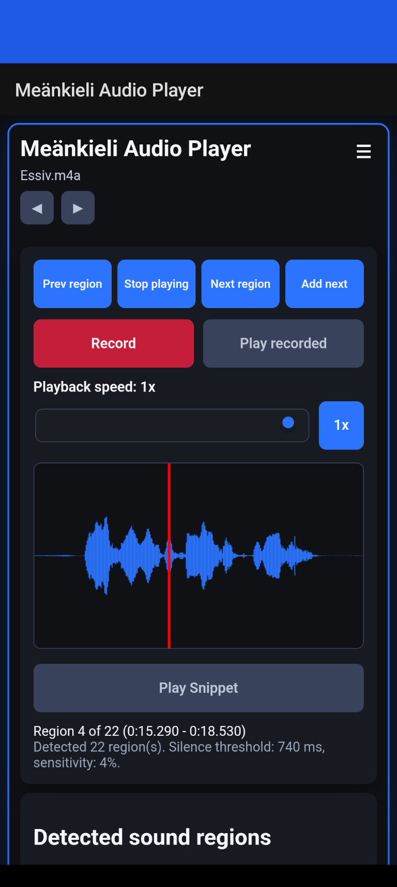

# Meänkieli self-study materials

Läromedel i meänkieli för självstudier.

This collection brings together dialogue recordings, grammar examples, source documents, and local study apps. Start by reading a folder's dialogue text, then practice its recording in the browser audio player.

The recordings, Word documents, folder READMEs, and apps are organized below. The [app guide](Me%C3%A4nkieli/Apps/README.md) contains instructions. 

## Start studying

1. [Audio files for the android app can be found here](Me%C3%A4nkieli/Audio%20files%20for%20android%20app/README.md). Set 1 and Set 2 progress in complexity, grammatik contains a variety of grammatical forms practice, and Set 3 is most complex. Additional audio files are in development and this repo will be updated regularly.
2. [download the android apk and install](https://github.com/soomrenald/meankieli-laromedel/blob/main/Me%C3%A4nkieli/Apps/dialogue-trainer-v0.3.apk) Because this is not sourced from the google play store, you may need to [enable installation from unknown sources](https://docs.pandasuite.com/essentials/mobile-publishing/android/install-app-from-unknown-sources-on-android-device/). 
3. [Download audio files](Me%C3%A4nkieli/Audio%20files%20for%20android%20app/README.md) and load them in them app.

The [app guide](Me%C3%A4nkieli/Apps/README.md) explains the controls and usage.

## App screenshots

<p>
<a href="Me%C3%A4nkieli/Apps/README.md#android-dictionaries"></a>
<a href="Me%C3%A4nkieli/Apps/README.md#playback-and-navigation"></a>
</p>

*Dictionary search and audio playback. [See all five screens and their controls](Me%C3%A4nkieli/Apps/README.md), including settings, snippet playback, recording, and how to repair a split utterance with **Add next**.*

In addition to the android app, there is also a [browser implementation](https://github.com/soomrenald/meankieli-laromedel/blob/main/Me%C3%A4nkieli/Apps/Audio_player_web_version.html). More information about this implementation can be found [in the readme](https://github.com/soomrenald/meankieli-laromedel/blob/main/Me%C3%A4nkieli/Apps/README.md#web-audio-player).

## Meänkieli Sanakirja

[This Swedish-Meänkieli dictionary is an android app](https://github.com/soomrenald/meankieli-laromedel/blob/main/Me%C3%A4nkieli/Apps/meankieli_dict_small.apk) which references the database maintained by [Institutet för språk och folkminnen](https://xn--sprk-soa.isof.se/me%c3%a4nkieli/). More information can be found [in the readme](https://github.com/soomrenald/meankieli-laromedel/blob/main/Me%C3%A4nkieli/Apps/README.md).

## Repository structure

```text
README.md
docs/
  MEDIA.md
  IMPORT.md
  archive-manifest.json
  transcript-alignment.json
  DATA_SOURCES.md
  APP_VERIFICATION.md
  images/apps/              five original Android screenshots
Meänkieli/
  Apps/
    Audio_player_web_version.html
    dialogue-trainer-v0.3.apk
    Meankieli_dict_large.apk
    meankieli_dict_small.apk
    README.md
  Audio files for android app/
    set 1/                  20 everyday-dialogue recordings
    set 2/                  15 numbered conversations
    set 3/                  10 page-named recordings and replacement source
    grammatik/
      böjning/              12 case recordings
      prepositioner/        11 preposition recordings
      dåtid/                15 past-tense recordings, including an alternate take
  Completed audio files/
    Del 1/                  20 MP3/WAV recordings
    Del 2/                  15 processed WAV recordings
    Del 3/                   5 processed case WAV recordings
  Docs/                     Word originals, Markdown, and vocabulary XLSX files
  dictionary for chrome.zip  Gboard wordlist in its original archive
  Archive/                  earlier trainer APKs and replaced Set 3 document
```

[Browse all materials](Me%C3%A4nkieli/README.md) · [Documents](Me%C3%A4nkieli/Docs/README.md) · [Original recordings](Me%C3%A4nkieli/Completed%20audio%20files/README.md)

## Dialogue sources

The folder READMEs contain the transcripts for the audio files. Each Meänkieli utterance appears beside its source Swedish translation in a table. All material contained in the audio files and transcripts is original and fictitious. All names appearing are fictitious. 

## Future work

This repo is regularly maintained and new audio file material is in development and will be updated here. Additional language study resources are also in development and will be updated here when published.


